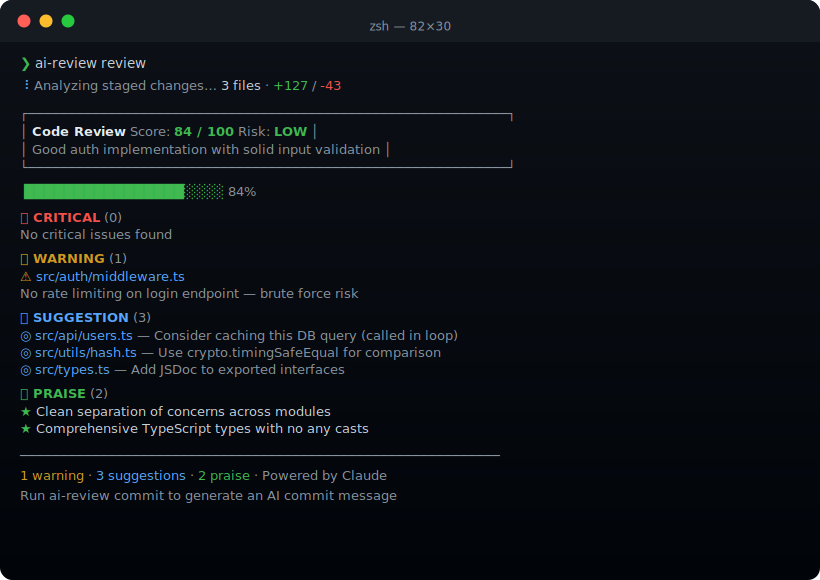

<div align="center">

# 🔍 ai-review-cli

**A senior engineer in your terminal — powered by Claude.**

Get instant, structured code reviews on your staged changes. Catch bugs, security issues, and bad patterns before they ever reach your teammates.

[](https://nodejs.org)
[](https://www.typescriptlang.org)
[](https://anthropic.com)
[](LICENSE)



</div>

---

## Why ai-review-cli?

Code review is the most valuable part of the dev workflow — and the most often skipped when you're in a hurry.

`ai-review-cli` gives you a thorough review of every change before you push, without waiting for a colleague. It spots security holes, suggests optimizations, and praises what you got right — all inside your terminal.

```bash
npx ai-review-cli review
```

No PR required. No context switching. Just better code.

---

## Features

- **Instant Code Review** — Analyzes your staged diff and returns a structured review in seconds
- **Severity Scoring** — Issues ranked as Critical / Warning / Suggestion / Praise, so you know what to fix first
- **100-Point Score** — At a glance quality score with risk level (Low / Medium / High)
- **AI Commit Messages** — Generate conventional commit messages from your staged changes
- **Code Explanation** — Ask Claude to explain any file or function in plain English
- **Demo Mode** — Works without an API key — try it before you commit to anything
- **Works anywhere** — Staged changes, last commit, or any specific file

---

## Quick Start

```bash
# Try it now — no API key needed (demo mode)
npx ai-review-cli review

# With real Claude reviews
export ANTHROPIC_API_KEY=sk-ant-...
npx ai-review-cli review
```

---

## Commands

### `review` — Review your staged changes

```bash
ai-review review                    # Review staged changes (default)
ai-review review --last-commit      # Review the last commit
ai-review review --file src/api.ts  # Review a specific file
```

```
┌────────────────────────────────────────────────────────┐
│  Code Review    Score: 84 / 100    Risk: LOW            │
│  Good auth implementation with solid input validation   │
└────────────────────────────────────────────────────────┘

🔴 CRITICAL  (0)    No critical issues found

🟡 WARNING  (1)
  ⚠  src/auth/middleware.ts
     No rate limiting on login — brute force risk

💡 SUGGESTION  (3)
  ◎  src/api/users.ts  — Consider caching DB query (called in loop)
  ◎  src/utils/hash.ts  — Use crypto.timingSafeEqual for comparison
  ◎  src/types.ts  — Add JSDoc to exported interfaces

✅ PRAISE  (2)
  ★  Clean separation of concerns across modules
  ★  Comprehensive TypeScript types, no any casts
```

---

### `commit` — AI-generated commit message

```bash
ai-review commit
```

```
Proposed commit message:
  feat(auth): add JWT middleware with bearer token validation

  - Extracts token validation logic to utils/hash.ts
  - Adds middleware factory pattern for reusable auth guards

Use this message? (Y/n) █
```

---

### `explain` — Explain a file or function

```bash
ai-review explain src/auth/middleware.ts
ai-review explain src/api/users.ts --function getUserById
```

---

## Setup

**Option 1: Demo mode (no key needed)**

Just run `ai-review review` — you'll get a realistic sample review with a `DEMO MODE` banner.

**Option 2: Real reviews with Claude**

```bash
# Get a free API key at console.anthropic.com
export ANTHROPIC_API_KEY=sk-ant-...

# Or add to your shell profile
echo 'export ANTHROPIC_API_KEY=sk-ant-...' >> ~/.zshrc
```

---

## Score Guide

| Score | Meaning |
|---|---|
| 90–100 | 🟢 Ship it |
| 75–89 | 🟢 Minor polish recommended |
| 60–74 | 🟡 Address warnings before merging |
| 45–59 | 🟡 Several issues to fix |
| < 45 | 🔴 Do not merge — significant issues |

---

## Tech Stack

| Technology | Version | Purpose |
|---|---|---|
| Node.js | 20+ | Runtime |
| TypeScript | 5.7 | Strict type safety |
| @anthropic-ai/sdk | 0.39 | Claude API client |
| simple-git | 3 | Git diff extraction |
| Commander | 12 | CLI argument parsing |
| Chalk | 5 | Terminal colors |
| Boxen | 8 | Bordered output |

---

## License

MIT © [Mario Tavarez](https://github.com/mariotavarez)
